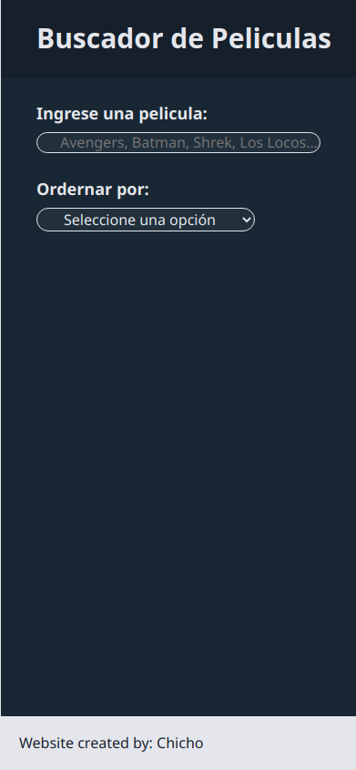
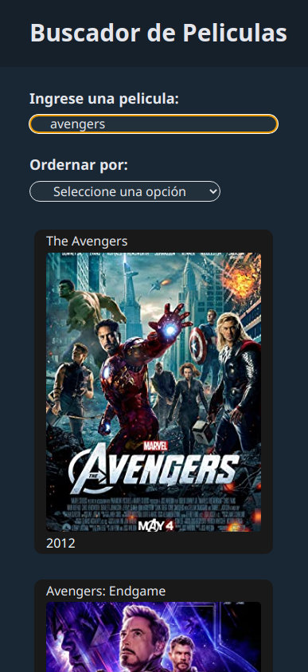
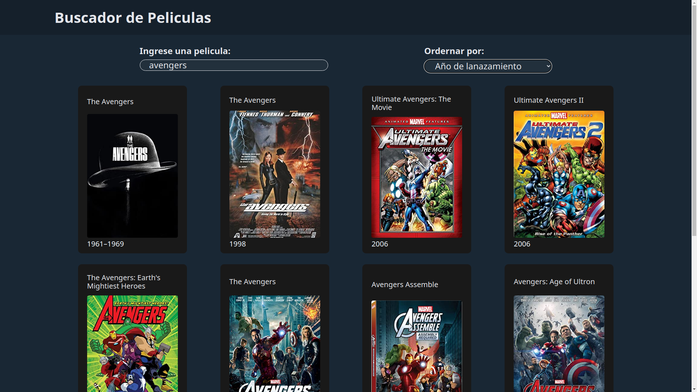

# React Movie Search

This is a solution to the callenge [React Movie Search](https://github.com/midudev/aprendiendo-react/tree/master/projects/05-react-buscador-peliculas) from Midudev.

## Table of contents

- [Overview](#overview)
  - [The challenge](#the-challenge)
  - [Screenshot](#screenshot)
  - [Link](#links)
- [My process](#my-process)
  - [Built with](#built-with)
  - [What I learned](#what-i-learned)

## Overview

### The challenge

Users should be able to:

- View the optimal layout for the site depending on their device's screen size
- Search any by completing a controlled form
- There must be an option to sort movies by title and year
- If the input is valid only after a period of time the search must be made (debounce)

### Screenshot

### Link

- Live Site URL: [https://buscador-de-peliculas-chicho.netlify.app/](https://buscador-de-peliculas-chicho.netlify.app/)

## My process

### Built with

- Semantic HTML5 markup
- CSS custom properties
- Flexbox
- CSS Grid
- Debounce
- Playwright (e2e)
- Mobile-first workflow
- [React](https://reactjs.org/) - JS library

### What I learned

The main challenge of this exercise was to integrate the components on the work-flow. Since this exercise was a little bit extend, it was difficult to debug it. However, since the project was made following standard practices (modularization, linters, etc), only one component at a time needed to be checked.